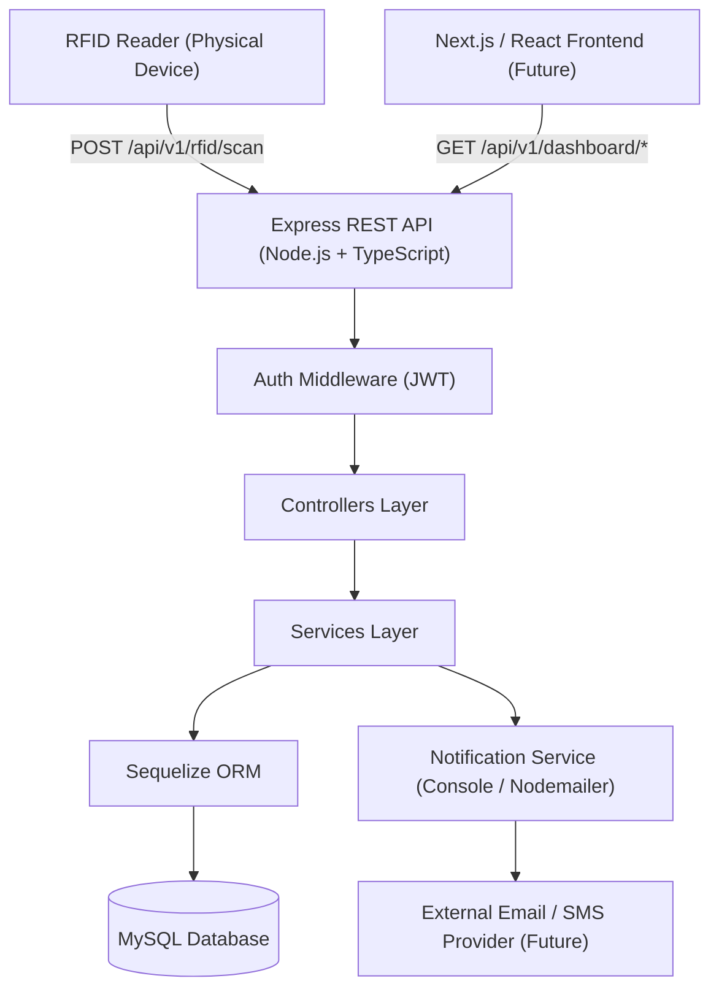
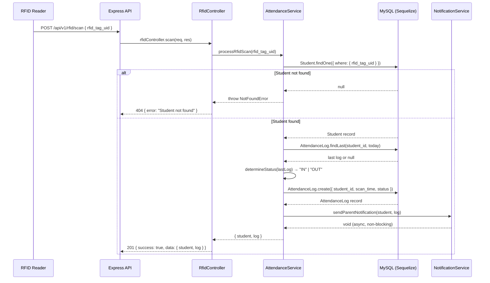
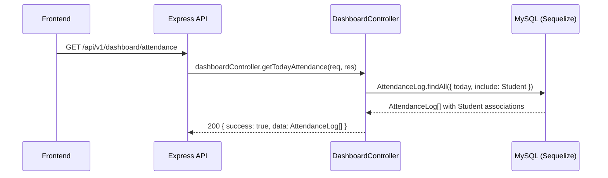

# Design Document: School Attendance Monitoring System

## Overview

This backend system enables a school to monitor student attendance in real time using RFID card scanning. When a student taps their RFID card on a physical reader, the backend validates the card, records an attendance log (IN or OUT) in a MySQL database via Sequelize ORM, and automatically notifies the student's parent or guardian. The system is built as a decoupled REST API using Node.js, Express, and TypeScript, with a clear separation between routing, controller logic, data access, and notification services.

The architecture is designed to be consumed by a Next.js/React frontend in a later phase. All endpoints return typed JSON responses, and all models are backed by strict TypeScript interfaces to ensure end-to-end type safety.

---

## Architecture



---

## Folder Structure

```
/src
  /config
    database.ts          # Sequelize connection & pool config
  /models
    index.ts             # Model registry & associations
    User.ts              # Staff/Admin model
    Student.ts           # Student model with RFID
    AttendanceLog.ts     # Attendance event log model
  /controllers
    rfidController.ts    # Handles RFID scan logic
    dashboardController.ts
  /routes
    rfid.ts
    dashboard.ts
    index.ts             # Mounts all routers
  /services
    attendanceService.ts # Core IN/OUT determination logic
    notificationService.ts
  /types
    express.d.ts         # Augmented Request types
    models.ts            # Shared TS interfaces
  /middleware
    errorHandler.ts
  app.ts                 # Express app setup (CORS, JSON, routes)
  server.ts              # HTTP server entry point
```

---

## Sequence Diagrams

### RFID Scan Flow



### Dashboard Attendance Query Flow



---

## Components and Interfaces

### Component 1: RfidController

**Purpose**: Validates the incoming RFID scan request and delegates to AttendanceService.

**Interface**:
```typescript
interface RfidController {
  scan(req: Request<{}, {}, RfidScanBody>, res: Response): Promise<void>
}

interface RfidScanBody {
  rfid_tag_uid: string
}
```

**Responsibilities**:
- Parse and validate `rfid_tag_uid` from the request body
- Call `AttendanceService.processRfidScan()`
- Return typed JSON response with appropriate HTTP status codes
- Delegate all errors to the centralized error handler

---

### Component 2: DashboardController

**Purpose**: Serves aggregated attendance data for dashboard views.

**Interface**:
```typescript
interface DashboardController {
  getTodayAttendance(req: Request, res: Response): Promise<void>
  getStats(req: Request, res: Response): Promise<void>
}
```

**Responsibilities**:
- Query today's attendance logs with student associations
- Compute aggregate stats (present count, absent count, late count)
- Return typed JSON with correct HTTP 200 responses

---

### Component 3: AttendanceService

**Purpose**: Core business logic for determining IN/OUT status and persisting logs.

**Interface**:
```typescript
interface AttendanceService {
  processRfidScan(rfid_tag_uid: string): Promise<ScanResult>
  getTodayLogs(): Promise<AttendanceLogWithStudent[]>
  getTodayStats(): Promise<AttendanceStats>
}

interface ScanResult {
  student: StudentAttributes
  log: AttendanceLogAttributes
}
```

**Responsibilities**:
- Look up student by RFID tag UID
- Determine current scan status based on the last log of the day
- Create a new AttendanceLog record
- Call NotificationService (non-blocking)

---

### Component 4: NotificationService

**Purpose**: Sends parent notifications when a student scans in or out.

**Interface**:
```typescript
interface NotificationService {
  sendParentNotification(student: StudentAttributes, log: AttendanceLogAttributes): Promise<void>
}
```

**Responsibilities**:
- Format a notification message with student name, status, and timestamp
- Log notification details to the console (development mode)
- Provide commented-out Nodemailer boilerplate for future email integration

---

## Data Models

### Model 1: User (Staff/Admin)

```typescript
interface UserAttributes {
  id: number
  name: string
  email: string
  password_hash: string
  role: 'admin' | 'staff'
  createdAt?: Date
  updatedAt?: Date
}
```

**Validation Rules**:
- `email` must be unique and a valid email format
- `role` must be one of `'admin'` or `'staff'`
- `password_hash` must never be exposed in API responses

---

### Model 2: Student

```typescript
interface StudentAttributes {
  id: number
  rfid_tag_uid: string     // unique, indexed
  name: string
  grade_level: string
  section: string
  parent_name: string
  parent_email: string
  parent_phone: string
  createdAt?: Date
  updatedAt?: Date
}
```

**Validation Rules**:
- `rfid_tag_uid` must be unique across all students and is indexed for fast lookups
- `parent_email` must be a valid email format
- `parent_phone` must be a non-empty string

---

### Model 3: AttendanceLog

```typescript
interface AttendanceLogAttributes {
  id: number
  student_id: number
  scan_time: Date
  status: 'IN' | 'OUT'
  createdAt?: Date
  updatedAt?: Date
}

interface AttendanceLogWithStudent extends AttendanceLogAttributes {
  Student: StudentAttributes
}
```

**Validation Rules**:
- `status` must be `'IN'` or `'OUT'` only (enforced via Sequelize ENUM)
- `student_id` is a foreign key referencing `Students.id`
- `scan_time` defaults to the current server timestamp if not provided

---

## Key Functions with Formal Specifications

### Function 1: `processRfidScan()`

```typescript
async function processRfidScan(rfid_tag_uid: string): Promise<ScanResult>
```

**Preconditions:**
- `rfid_tag_uid` is a non-empty string
- A valid Sequelize connection to MySQL is established
- The `Student` and `AttendanceLog` models are initialized

**Postconditions:**
- If student not found: throws a `NotFoundError` with HTTP 404
- If student found: a new `AttendanceLog` record is created with `status` either `'IN'` or `'OUT'`
- `sendParentNotification` is called asynchronously (does not block the response)
- Returns `{ student, log }` where both are fully typed model instances

**Loop Invariants:** N/A

---

### Function 2: `determineStatus()`

```typescript
function determineStatus(lastLog: AttendanceLogAttributes | null): 'IN' | 'OUT'
```

**Preconditions:**
- `lastLog` is either a valid `AttendanceLogAttributes` object or `null`

**Postconditions:**
- Returns `'IN'` if `lastLog` is `null` (first scan of the day) or if `lastLog.status === 'OUT'`
- Returns `'OUT'` if `lastLog.status === 'IN'`
- Return value is always exactly `'IN'` or `'OUT'` — no other value is possible

**Loop Invariants:** N/A

---

### Function 3: `getTodayLogs()`

```typescript
async function getTodayLogs(): Promise<AttendanceLogWithStudent[]>
```

**Preconditions:**
- Valid Sequelize connection is active
- `AttendanceLog` model has an `include: [Student]` association defined

**Postconditions:**
- Returns all `AttendanceLog` records where `scan_time` falls within today's date range (00:00:00 to 23:59:59 UTC)
- Each record in the returned array includes the associated `Student` object
- Returns an empty array `[]` if no logs exist for today — never throws for empty results

**Loop Invariants:** N/A

---

### Function 4: `sendParentNotification()`

```typescript
async function sendParentNotification(
  student: StudentAttributes,
  log: AttendanceLogAttributes
): Promise<void>
```

**Preconditions:**
- `student.parent_email` is a valid email string
- `log.status` is `'IN'` or `'OUT'`
- `log.scan_time` is a valid `Date`

**Postconditions:**
- Logs a formatted notification message to `console.log` including student name, status, time, and parent contact
- Does not throw; any internal error is caught and logged without propagation
- In the future Nodemailer path: an email would be sent to `student.parent_email`

**Loop Invariants:** N/A

---

## Algorithmic Pseudocode

### Main RFID Scan Algorithm

```pascal
ALGORITHM processRfidScan(rfid_tag_uid)
INPUT: rfid_tag_uid of type string
OUTPUT: ScanResult { student: StudentAttributes, log: AttendanceLogAttributes }

BEGIN
  ASSERT rfid_tag_uid IS NOT empty

  // Step 1: Resolve student from database
  student ← Student.findOne(WHERE rfid_tag_uid = rfid_tag_uid)

  IF student IS NULL THEN
    THROW NotFoundError("Student with RFID tag not found")
  END IF

  // Step 2: Find the last log for this student today
  todayStart ← startOfDay(now())
  todayEnd   ← endOfDay(now())

  lastLog ← AttendanceLog.findOne(
    WHERE student_id = student.id
    AND   scan_time BETWEEN todayStart AND todayEnd
    ORDER BY scan_time DESC
    LIMIT 1
  )

  // Step 3: Determine next status
  status ← determineStatus(lastLog)

  // Step 4: Persist new attendance log
  newLog ← AttendanceLog.create({
    student_id : student.id,
    scan_time  : now(),
    status     : status
  })

  // Step 5: Trigger parent notification (non-blocking)
  sendParentNotification(student, newLog)  // fire-and-forget

  RETURN { student, log: newLog }
END
```

---

### Status Determination Algorithm

```pascal
ALGORITHM determineStatus(lastLog)
INPUT:  lastLog of type AttendanceLogAttributes OR null
OUTPUT: status of type "IN" | "OUT"

BEGIN
  IF lastLog IS NULL THEN
    RETURN "IN"   // First scan of the day — student is arriving
  END IF

  IF lastLog.status EQUALS "IN" THEN
    RETURN "OUT"  // Last seen entering — now leaving
  ELSE
    RETURN "IN"   // Last seen leaving — now entering again
  END IF
END
```

---

### Get Today's Stats Algorithm

```pascal
ALGORITHM getTodayStats()
INPUT:  none
OUTPUT: AttendanceStats { presentCount, absentCount, lateThreshold, onTimeCount }

BEGIN
  todayStart    ← startOfDay(now())
  todayEnd      ← endOfDay(now())
  lateThreshold ← todayStart + 8 hours  // e.g., 08:00 AM

  // Fetch all students and today's first IN logs
  allStudents ← Student.findAll()
  firstInLogs ← AttendanceLog.findAll(
    WHERE status = "IN"
    AND   scan_time BETWEEN todayStart AND todayEnd
    GROUP BY student_id
    HAVING MIN(scan_time)
  )

  presentIds ← SET of student_ids from firstInLogs
  absentCount ← COUNT(allStudents) - COUNT(presentIds)

  onTimeCount ← 0
  lateCount   ← 0

  FOR each log IN firstInLogs DO
    IF log.scan_time <= lateThreshold THEN
      onTimeCount ← onTimeCount + 1
    ELSE
      lateCount ← lateCount + 1
    END IF
  END FOR

  RETURN {
    presentCount : COUNT(presentIds),
    absentCount  : absentCount,
    onTimeCount  : onTimeCount,
    lateCount    : lateCount
  }
END
```

---

## Example Usage

```typescript
// --- POST /api/v1/rfid/scan ---
// Request body
const body: RfidScanBody = { rfid_tag_uid: "04:A3:B2:11:22:33:44" }

// Successful response (201)
const response: ApiResponse<ScanResult> = {
  success: true,
  data: {
    student: {
      id: 7,
      rfid_tag_uid: "04:A3:B2:11:22:33:44",
      name: "Maria Santos",
      grade_level: "Grade 10",
      section: "Narra",
      parent_name: "Jose Santos",
      parent_email: "jose.santos@email.com",
      parent_phone: "+63912345678"
    },
    log: {
      id: 142,
      student_id: 7,
      scan_time: new Date("2025-01-15T07:45:00.000Z"),
      status: "IN"
    }
  }
}

// Error response (404)
const errorResponse: ApiErrorResponse = {
  success: false,
  error: "Student not found for RFID tag: 04:XX:XX:XX:XX:XX:XX"
}

// --- GET /api/v1/dashboard/stats ---
// Successful response (200)
const statsResponse: ApiResponse<AttendanceStats> = {
  success: true,
  data: {
    presentCount: 38,
    absentCount: 7,
    onTimeCount: 31,
    lateCount: 7
  }
}
```

---

## Correctness Properties

*A property is a characteristic or behavior that should hold true across all valid executions of a system — essentially, a formal statement about what the system should do. Properties serve as the bridge between human-readable specifications and machine-verifiable correctness guarantees.*

---

### Property 1: RFID Scan Creates a Valid Log

*For any* non-empty `rfid_tag_uid` that matches a Student in the database, calling `processRfidScan` SHALL create a new AttendanceLog whose `status` is exactly `'IN'` or `'OUT'` and whose `student_id` matches the found Student — it never returns `undefined`, throws an untyped error, or produces an invalid status.

**Validates: Requirements 1.1, 1.2, 2.5**

---

### Property 2: Status Alternation (determineStatus)

*For any* value of `lastLog` — whether `null`, `{ status: 'IN' }`, or `{ status: 'OUT' }` — `determineStatus(lastLog)` SHALL return:
- `'IN'` when `lastLog` is `null` (first scan of the day),
- `'OUT'` when `lastLog.status === 'IN'`,
- `'IN'` when `lastLog.status === 'OUT'`.

The return value is always exactly `'IN'` or `'OUT'`.

**Validates: Requirements 2.1, 2.2, 2.3, 2.5**

---

### Property 3: Today Boundary Isolation

*For any* Student with AttendanceLog records exclusively from previous days (scan_time before today's 00:00:00), `determineStatus` SHALL behave as if no logs exist for that student today, returning `'IN'` as the status for a new scan.

**Validates: Requirements 2.4**

---

### Property 4: Non-blocking Notification Resilience

*For any* internal error thrown inside `sendParentNotification()`, the function SHALL catch the error without re-throwing it, and the scan endpoint SHALL still return HTTP 201 with the committed AttendanceLog — no rollback occurs.

**Validates: Requirements 3.3, 8.3**

---

### Property 5: Notification Message Completeness

*For any* valid Student and AttendanceLog pair, the notification message formatted by NotificationService SHALL include the student's name, scan status, scan time, and parent contact information — no required field is ever omitted.

**Validates: Requirements 3.1**

---

### Property 6: Today's Attendance Query Isolation

*For any* mix of AttendanceLog records spanning multiple days, `getTodayLogs()` SHALL return only records whose `scan_time` falls within the current day's range (00:00:00 to 23:59:59 server time), and each returned record SHALL include the associated Student object.

**Validates: Requirements 4.1, 4.2**

---

### Property 7: Stats Partition Invariant

*For any* state of the database, `getTodayStats()` SHALL satisfy `presentCount + absentCount = totalStudentCount`. A Student is counted as present if and only if they have at least one `'IN'` log today; otherwise they are absent. The function SHALL return the same result on repeated calls with no intervening scans (idempotence).

**Validates: Requirements 5.2, 5.3, 5.6**

---

### Property 8: On-time / Late Classification

*For any* present Student, the on-time/late classification SHALL depend solely on whether the Student's first `'IN'` scan of the day occurred at or before the Late_Threshold (08:00 AM): on-time if `scan_time ≤ Late_Threshold`, late if `scan_time > Late_Threshold`. The sum `onTimeCount + lateCount` SHALL equal `presentCount`.

**Validates: Requirements 5.4, 5.5**

---

### Property 9: Authentication Guards All Protected Endpoints

*For any* request to `GET /api/v1/dashboard/*` without a valid JWT, or any request to `POST /api/v1/rfid/scan` without a valid API_Key, THE API SHALL return HTTP 401 — no data is returned and no side-effects (log creation, notifications) occur.

**Validates: Requirements 6.1, 6.2**

---

### Property 10: Password Hash Exclusion

*For any* API response body produced by any endpoint, the field `password_hash` (or its value) SHALL never appear — regardless of which User triggered the request or what data was queried.

**Validates: Requirements 6.4**

---

### Property 11: RFID Uniqueness Invariant

*For all* students s1, s2 in the database, if `s1.id ≠ s2.id` then `s1.rfid_tag_uid ≠ s2.rfid_tag_uid`. Any attempt to create or update a Student with a duplicate `rfid_tag_uid` SHALL be rejected with an error — no partial state is persisted.

**Validates: Requirements 7.1**

---

### Property 12: Student Validation Completeness

*For any* Student creation request where any required field (`name`, `grade_level`, `section`, `parent_name`, `parent_email`, `parent_phone`) is empty, null, or — for `parent_email` — not a valid email format, THE API SHALL reject the request without persisting a partial Student record.

**Validates: Requirements 7.2, 7.3**

---

### Property 13: Database Unavailability Returns Safe Generic Error

*For any* API request processed when the MySQL database is unreachable, THE API SHALL return HTTP 503 with the body `{ success: false, error: "Service temporarily unavailable" }` — internal connection details, stack traces, or credentials SHALL never appear in the response body.

**Validates: Requirements 8.1**

---

### Property 14: AttendanceLog Status ENUM Enforcement

*For any* attempt to persist an AttendanceLog with a `status` value other than `'IN'` or `'OUT'`, THE API SHALL reject the operation — the record is never created and the invalid value is never stored in the database.

**Validates: Requirements 9.2**

---

### Property 15: Response Envelope Consistency

*For any* API request — whether it succeeds or fails — the JSON response body SHALL conform to exactly one of the two envelope schemas: `{ success: true, data: <payload> }` on success, or `{ success: false, error: "<message>" }` on failure. The `Content-Type` response header SHALL always be `application/json`.

**Validates: Requirements 10.1, 10.2, 10.3**

---

## Error Handling

### Error Scenario 1: Unknown RFID Tag

**Condition**: `POST /api/v1/rfid/scan` received with an `rfid_tag_uid` that does not exist in the `Students` table.  
**Response**: HTTP 404 `{ success: false, error: "Student not found for RFID tag: <uid>" }`  
**Recovery**: No log is created. The RFID reader receives a 404 and can display an alert LED.

---

### Error Scenario 2: Missing Request Body Field

**Condition**: Request body is missing `rfid_tag_uid` or the field is an empty string.  
**Response**: HTTP 400 `{ success: false, error: "rfid_tag_uid is required" }`  
**Recovery**: Validated at the controller layer before any database query is attempted.

---

### Error Scenario 3: Database Connection Failure

**Condition**: Sequelize cannot reach the MySQL database (network timeout, wrong credentials).  
**Response**: HTTP 503 `{ success: false, error: "Service temporarily unavailable" }`  
**Recovery**: Sequelize connection pool retries are configured. The error is logged server-side with full stack trace. The generic message is returned to the client to avoid information leakage.

---

### Error Scenario 4: Notification Failure

**Condition**: `sendParentNotification()` throws internally (e.g., SMTP error in future Nodemailer path).  
**Response**: The scan endpoint still returns HTTP 201 success — the log was already committed.  
**Recovery**: The notification error is caught internally and logged to the server console/log file. No rollback occurs.

---

## Testing Strategy

### Unit Testing Approach

Test each service function in isolation using mocked Sequelize models.

**Key unit test cases:**
- `determineStatus(null)` → returns `'IN'`
- `determineStatus({ status: 'IN' })` → returns `'OUT'`
- `determineStatus({ status: 'OUT' })` → returns `'IN'`
- `processRfidScan('unknown-uid')` → throws `NotFoundError`
- `sendParentNotification()` catches internal errors without propagating

### Property-Based Testing Approach

**Property Test Library**: fast-check

**Properties to test:**
- For any non-empty `rfid_tag_uid` string, `processRfidScan` either returns a valid `ScanResult` or throws a typed error — it never returns `undefined` or an untyped value.
- For any sequence of alternating IN/OUT logs for a student, `determineStatus(lastLog)` always returns the opposite of `lastLog.status`.
- `getTodayStats().presentCount + getTodayStats().absentCount === totalStudentCount` for any state of the database.

### Integration Testing Approach

Use a dedicated test MySQL database (or SQLite in-memory via `sequelize-mock`) to test full request → database → response cycles.

**Key integration test cases:**
- Full RFID scan flow: insert student → POST scan → verify log created → verify notification called
- Duplicate scan within same day toggles status correctly
- Dashboard endpoints return correct counts matching seeded data

---

## Performance Considerations

- **RFID Lookup Index**: The `rfid_tag_uid` column is indexed (UNIQUE) — lookup is O(log n) via B-tree index regardless of student table size.
- **Connection Pooling**: Sequelize is configured with `pool: { max: 10, min: 2, acquire: 30000, idle: 10000 }` to handle concurrent scan bursts during school entry/exit times.
- **Dashboard Queries**: Today's attendance queries use a date range filter on an indexed `scan_time` column. For large schools, consider adding a composite index on `(student_id, scan_time)`.
- **Notification Async**: `sendParentNotification()` is called with `void` (fire-and-forget) so it never adds latency to the scan response.

---

## Security Considerations

- **Password Storage**: `User.password_hash` stores only bcrypt-hashed passwords. Plain-text passwords are never persisted or logged.
- **RFID Spoofing**: The API should be protected by an API key or JWT middleware so that only registered RFID readers can POST to `/api/v1/rfid/scan`.
- **SQL Injection**: Sequelize parameterized queries are used exclusively — no raw SQL string interpolation.
- **CORS**: Express CORS middleware is configured to whitelist only the frontend origin in production.
- **Error Leakage**: Internal database errors return generic `503` messages to clients; full errors are logged server-side only.
- **Sensitive Data**: `parent_email` and `parent_phone` are PII — access to `/api/v1/dashboard/*` should require authentication.

---

## Dependencies

| Package | Version | Purpose |
|---|---|---|
| `express` | ^4.18.x | HTTP server framework |
| `sequelize` | ^6.x | ORM for MySQL |
| `mysql2` | ^3.x | MySQL driver (required by Sequelize) |
| `dotenv` | ^16.x | Environment variable management |
| `cors` | ^2.x | CORS middleware |
| `typescript` | ^5.x | TypeScript compiler |
| `ts-node-dev` | ^2.x | Dev server with hot reload |
| `@types/express` | ^4.x | Express type definitions |
| `@types/node` | ^20.x | Node.js type definitions |
| `@types/cors` | ^2.x | CORS type definitions |
| `fast-check` | ^3.x | Property-based testing |
| `jest` | ^29.x | Test runner |
| `ts-jest` | ^29.x | TypeScript Jest transformer |
| `nodemailer` | ^6.x | Email sending (future use) |
| `@types/nodemailer` | ^6.x | Nodemailer type definitions |
